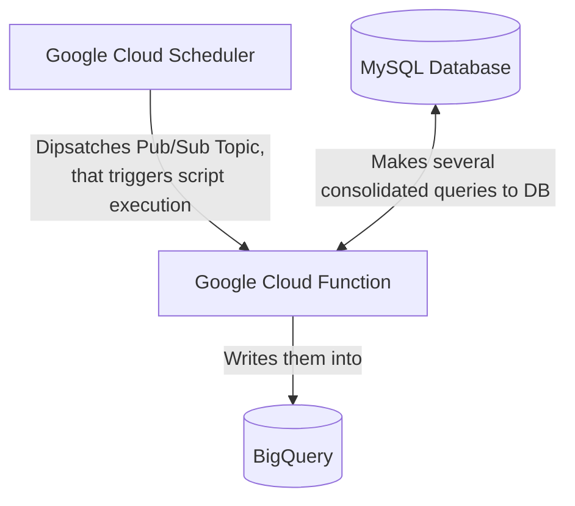

# Atomi Migration

This project is based on Google Cloud Infrastucture.

## GCP services: 
### Migration script operationals:  
- Cloud Functions
- Cloud Scheduler
- Pub/Sub Topics

### Storage: 
- BigQuery

### Network: 
- VPC Network
    - Cloud NAT
    - External Ip Address (static IP reservation)
    - Serverless VPC access

## Schematics

## Network
We are assigning a static IP address for Serverless Function. In order to make it we use Cloud NAT and Serverless VPC. This is done like that, cause serverless function is not a static instance that we pay for, that's why we need to route the traffic to have a stable, static IP address.
